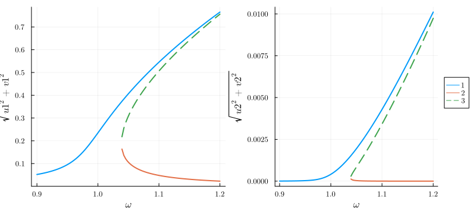
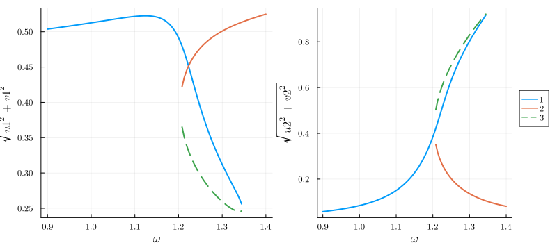

# [Introduction: the Duffing oscillator](@id Duffing)

Here we show the workflow of HarmonicBalance.jl on a simple example - the driven Duffing oscillator. The code is also available as a [Jupyter notebook](https://github.com/NonlinearOscillations/HarmonicBalance-notebooks). 

## The equations

The equation of motion for the displacement $x(t)$ reads

```math
\begin{equation} \label{eq:duffing}
\underbrace{\ddot{x}(t) + \gamma \dot{x}(t) + \omega_0^2 x(t)}_{\text{damped harmonic oscillator}} + \underbrace{\alpha x(t)^3}_{\text{Duffing coefficient}} = \underbrace{F \cos(\omega t)}_{\text{periodic drive}}
\end{equation}
```

For ``\alpha=0``, the system becomes linear and responds precisely at the drive frequency, so that ``x(t) = X \cos(\omega t + \phi)``, where ``X`` and ``\phi`` can be found analytically. For ``\alpha \neq 0`` this is no longer possible. 

We can obtain some intuition by treating ``\alpha`` perturbatively, i.e., by solving

```math
\ddot{x}(t) + \gamma \dot{x}(t) + \omega_0^2 x(t) + \epsilon \alpha x(t)^3 = F \cos(\omega t)
```
for small ``\epsilon``. To zeroth order, the response of the system is ``x_0(t) = X_0 \cos(\omega t + \phi_0)``. Expanding ``x(t) = x_0(t) + \epsilon x_1(t)``, we find that the perturbation ``x_1(t)`` satisfies to first order
```math
\ddot{x}_1(t) + \gamma \dot{x}_1(t) \left[ \omega_0^2 + \frac{3 \alpha X_0^2}{4} \right] x_1(t) = - \frac{\alpha X_0^3}{4} \cos(3 \omega t + 3 \phi_0) \,,
```
which gives a response of the form ``x_1(t) = X_1 \cos(3 \omega t + \phi_1)``. Clearly, the oscillator now responds not only at frequency ``\omega``, but also at ``3 \omega``! This effect is known as [*high harmonic generation*](https://en.wikipedia.org/wiki/High_harmonic_generation) or more generally *frequency conversion*. By continuing the procedure to higher orders, we eventually obtain an infinity of harmonics present in the response. In general, there is no analytical solution to such problems.

Fortunately, some harmonics are more important than others. By truncating the infinite-dimensional Fourier space to a set of judiciously chosen harmonics, we may obtain a soluble system. For the Duffing resonator, we can well try to only consider the drive frequency ``\omega``. To implement this, we use the *harmonic ansatz*

```math
x(t) = U \cos(\omega t) + V \sin(\omega t) \,,
```
which constraints the spectrum of ``x(t)`` to a single harmonic. Fixing the quadratures ``U`` and ``V`` to be constant then reduces the differential equation \eqref{eq:duffing} to two coupled cubic polynomial equations (for more details on this step, see the appendices in [https://scipost.org/SciPostPhysCodeb.6](https://scipost.org/SciPostPhysCodeb.6)). Finding the roots of coupled polynomials is in general very hard. We here apply the method of homotopy continuation, as implemented in [HomotopyContinuation.jl](https://www.juliahomotopycontinuation.org/) which is guaranteed to find the complete set of roots.

## The code

First we need to declare the symbolic variables (the excellent [Symbolics.jl](https://symbolics.juliasymbolics.org/stable/) is used here).
```julia
using HarmonicBalance
@variables α, ω, ω0, F, t, γ, x(t) # declare constant variables and a function x(t)
```
Next, we have to input Eq.\eqref{eq:duffing}. This will be stored as a `DifferentialEquation`. The input needs to specify that only `x` is a mathematical variable, the other symbols are parameters:
```julia
diff_eq = DifferentialEquation(d(x,t,2) + ω0^2*x + α*x^3 + γ*d(x,t) ~ F*cos(ω*t), x)
```
The harmonic ansatz needs to be specified now -- we expand `x` in a single frequency ``\omega``.
```julia
add_harmonic!(diff_eq, x, ω) # specify the ansatz x = u(T) cos(ωt) + v(T) sin(ωt)
```
The object `diff_eq` now contains all the necessary information
```
System of 1 differential equations
Variables:       x(t)
Harmonic ansatz: x(t) => ω;   

α*(x(t)^3) + (ω0^2)*x(t) + γ*Differential(t)(x(t)) + Differential(t)(Differential(t)(x(t))) ~ F*cos(t*ω)
```
We are ready to start plugging in numbers and solving! First we convert the differential equation to the algebraic *harmonic equations* (coupled polynomials in ``U`` and ``V``). 
```julia
harmonic_eq = get_harmonic_equations(diff_eq)
```
The resulting object `show`s:
```
A set of 2 harmonic equations
Variables: u1(T), v1(T)
Parameters: α, ω, γ, ω0, F

Harmonic ansatz: 
x(t) = u1*cos(ωt) + v1*sin(ωt)

Harmonic equations:

γ*Differential(T)(u1(T)) + (ω0^2)*u1(T) + (3//4)*α*(u1(T)^3) + γ*ω*v1(T) + (2//1)*ω*Differential(T)(v1(T)) + (3//4)*α*(v1(T)^2)*u1(T) - (ω^2)*u1(T) ~ F

(ω0^2)*v1(T) + γ*Differential(T)(v1(T)) + (3//4)*α*(v1(T)^3) + (3//4)*α*(u1(T)^2)*v1(T) - (ω^2)*v1(T) - (2//1)*ω*Differential(T)(u1(T)) - γ*ω*u1(T) ~ 0
```
The variables `u1` and `v1` were declared automatically to construct the harmonic ansatz. The *slow time* variable `T` describes variation of the quadratures on timescales much slower than `ω`. For a steady state, all derivatives w.r.t `T` vanish, leaving only algebraic equations to be solved. 

Let us now find steady states by solving `harmonic_eq` for numerical parameters. Homotopy continuation is especially suited to [solving over a range of parameter values](https://www.juliahomotopycontinuation.org/guides/parameter-homotopies/). Here we will solve over a range of driving frequencies `ω` -- these are stored as `{Sym, Vector{Float64}}` or `{Sym, LinRange}`:
```julia
varied = ω => LinRange(0.9, 1.2, 100) # range of parameter values
```
The other parameters we be fixed -- these are declared as `{Sym, Float64}` pairs:
```julia
fixed = (α => 1., ω0 => 1.0, F => 0.01, γ=>0.01) # fixed parameters
```
Now everything is ready to crank the handle. `get_steady_states` solves our `harmonic_eq` using the varied and fixed parameters:
```julia
result = get_steady_states(harmonic_eq, varied, fixed)
```
The results are `show`n:
```
A steady state result for 100 parameter points

Solution branches:   3
   of which real:    3
   of which stable:  2

Classes: stable, physical, Hopf, binary_labels
```
The algorithm has found 3 solution branches in total (out of the [hypothetically admissible](https://en.wikipedia.org/wiki/B%C3%A9zout%27s_theorem) ``3^{2} = 9``). All of these are real -- and thefore physically observable -- for at least some values of ``\omega``. Only 2 branches are stable under infinitesimal perturbations.

The "Classes" are boolean labels classifying each solution point, which may be used to select results for plotting. # hide

We now want to visualize the results. Here we plot the solution amplitude, ``\sqrt{U^2 + V^2}`` against the drive frequency ``\omega``: 
```julia
plot(result, "sqrt(u1^2 + v1^2)")
```
```@raw html

``` ⠀

This is the expected [response curve](https://en.wikipedia.org/wiki/Duffing_equation#Frequency_response) for the Duffing equation.


## Advanced: using multiple harmonics

In the above example, we truncated the Fourier space to a single harmonic ``\omega`` -- the oscillator was assumed to only oscillate at the drive frequency. We however also argued that frequency conversion takes place, to first order from ``\omega`` to ``3 \omega``. We can reflect this process by using a larger harmonic ansatz:
```math
\begin{equation}
x(t) = U_1 \cos(\omega t) + V_1 \sin(\omega t) + U_2 \cos(3\omega t) + V_2 \sin(3\omega t) \,.
\end{equation}
```
Note that this is not a perturbative treatment! The harmonics ``\omega`` and ``3 \omega`` are on the same footing here. This is implemented as
```julia
add_harmonic!(diff_eq, x, [ω, 3ω]) # specify the two-harmonics ansatz
harmonic_eq = get_harmonic_equations(diff_eq)
```
```
A set of 4 harmonic equations
Variables: u1(T), v1(T), u2(T), v2(T)
Parameters: ω, ω0, α, γ, F

Harmonic ansatz: 
x(t) = u1*cos(ωt) + v1*sin(ωt) + u2*cos(3ωt) + v2*sin(3ωt)

Harmonic equations:

(ω0^2)*u1(T) + γ*Differential(T)(u1(T)) + (3//4)*α*(u1(T)^3) + γ*ω*v1(T) + (2//1)*ω*Differential(T)(v1(T)) + (3//2)*α*(u2(T)^2)*u1(T) + (3//4)*α*(u1(T)^2)*u2(T) + (3//4)*α*(v1(T)^2)*u1(T) + (3//2)*α*(v2(T)^2)*u1(T) + (3//2)*α*u1(T)*v1(T)*v2(T) - (ω^2)*u1(T) - (3//4)*α*(v1(T)^2)*u2(T) ~ F

γ*Differential(T)(v1(T)) + (ω0^2)*v1(T) + (3//4)*α*(v1(T)^3) + (3//4)*α*(u1(T)^2)*v1(T) + (3//2)*α*(u2(T)^2)*v1(T) + (3//2)*α*(v2(T)^2)*v1(T) + (3//4)*α*(u1(T)^2)*v2(T) - (ω^2)*v1(T) - (2//1)*ω*Differential(T)(u1(T)) - γ*ω*u1(T) - (3//4)*α*(v1(T)^2)*v2(T) - (3//2)*α*u1(T)*u2(T)*v1(T) ~ 0

(ω0^2)*u2(T) + γ*Differential(T)(u2(T)) + (1//4)*α*(u1(T)^3) + (3//4)*α*(u2(T)^3) + (6//1)*ω*Differential(T)(v2(T)) + (3//2)*α*(u1(T)^2)*u2(T) + (3//4)*α*(v2(T)^2)*u2(T) + (3//2)*α*(v1(T)^2)*u2(T) + (3//1)*γ*ω*v2(T) - (9//1)*(ω^2)*u2(T) - (3//4)*α*(v1(T)^2)*u1(T) ~ 0

γ*Differential(T)(v2(T)) + (ω0^2)*v2(T) + (3//4)*α*(v2(T)^3) + (3//4)*α*(u1(T)^2)*v1(T) + (3//4)*α*(u2(T)^2)*v2(T) + (3//2)*α*(u1(T)^2)*v2(T) + (3//2)*α*(v1(T)^2)*v2(T) - (1//4)*α*(v1(T)^3) - (9//1)*(ω^2)*v2(T) - (6//1)*ω*Differential(T)(u2(T)) - (3//1)*γ*ω*u2(T) ~ 0

```
The variables `u1,v1` now encode `ω` and `u2, v2` encode `3ω`. We see this system is much harder to solve as we now have 4 harmonic variables, resulting in 4 coupled cubic equations. A maximum of ``3^4 = 81`` solutions [may appear](https://en.wikipedia.org/wiki/B%C3%A9zout%27s_theorem)! 

For the above parameters (where a perturbative treatment would have been reasonable), the principal response at ``\omega`` looks rather similar, with a much smaller upconverted component appearing at ``3 \omega``:


### Non-perturbative results (strong interactions)

The non-perturbative nature of Eq.(3) allows us to capture some behaviour which is *not* a mere extension of the usual single-harmonic Duffing response. Suppose we drive a strongly nonlinear resonator at frequency ``\omega \cong \omega_0 / 3``. Such a drive is far out of resonance, however, the upconverted harmonic ``3 \omega = \omega_0`` is not and may play an important role! Let us try this out:
```julia
fixed = (α => 10., ω0 => 3, F => 5, γ=>0.01)   # fixed parameters
varied = ω => LinRange(0.9, 1.4, 100)           # range of parameter values
result = get_steady_states(harmonic_eq, varied, fixed)
```
```
A steady state result for 100 parameter points

Solution branches:   9
   of which real:    3
   of which stable:  2

Classes: stable, physical, Hopf, binary_labels
```

Although 9 branches were found in total, only 3 remain physical (real-valued). Let us visualise the amplitudes corresponding to the two harmonics, ``\sqrt{U_1^2 + V_1^2}`` and ``\sqrt{U_2^2 + V_2^2}`` :
```julia
p1 = plot(result, "sqrt(u1^2 + v1^2)", legend=false)
p2 = plot(result, "sqrt(u2^2 + v2^2)")
plot(p1, p2)
```


The contributions of ``\omega`` and ``3\omega`` are now comparable and the system shows some fairly complex behaviour! This demonstrates how an exact solution within an extended Fourier subspace [Eq. (3)] goes beyond a perturbative treatment.