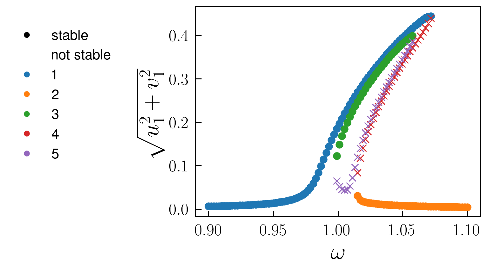
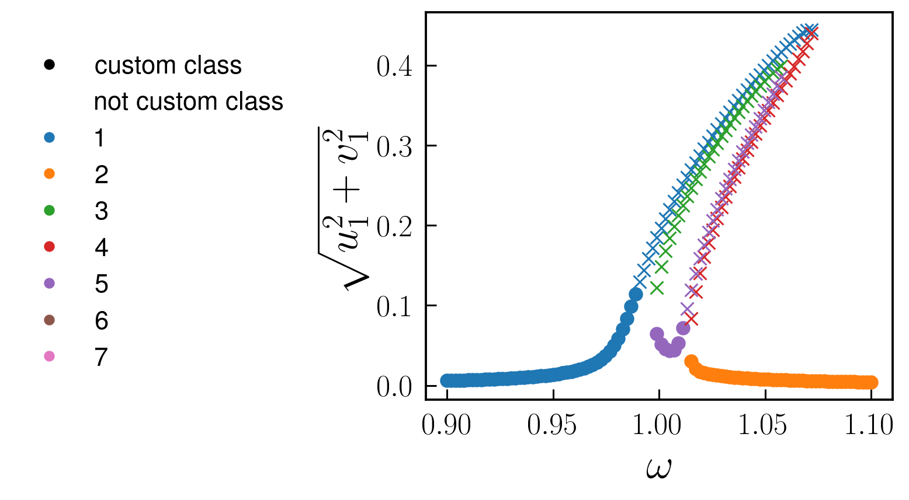

# [Parametrically driven Duffing resonator](@id parametron)

One of the most famous effects displaced by nonlinear oscillators is parametric resonance, where the frequency of the linear resonator is modulated in time 
[Phys. Rev. E 94, 022201 (2016)](https://doi.org/10.1103/PhysRevE.94.022201). In the following we analyse this system, governed by the equations

$$\ddot{x}(t)+\gamma\dot{x}(t)+\Omega^2(1-\lambda\cos(2\omega t + \psi))x + \alpha x^3 +\eta x^2 \dot{x}+F_\text{d}(t)=0$$

where for completeness we also considered an external drive term $F_\text{d}(t)=F\cos(\omega t + \theta)$ and a nonlinear damping term $\eta x^2 \dot{x}$

To implement this system in Harmonic Balance, we first import the library 
```julia
using HarmonicBalance.jl
```

Subsequently, we type define parameters in the problem and the oscillating amplitude function $x(t)$ using the `variables` macro from `Symbolics.jl` 

```julia
@variables Ω,γ,λ,F, x,θ,η,α, ω, ψ, x(t), t

natural_equation =  d(d(x,t),t) + γ*d(x,t) + Ω^2*(1-λ*cos(2*ω*t+ψ))*x + α * x^3 + η *d(x,t) * x^2
forces =  F*cos(ω*t+θ)
dEOM = HarmonicBalance.DifferentialEquation(natural_equation + forces, x)
```

Note that an equation of the form 
$$m \ddot{x}+m \omega_{0}^{2}\left(1-\lambda \cos (2\omega t+\psi)\right) x+\gamma \dot{x}+\alpha x^{3}+\eta x^{2} \dot{x}=F \cos \omega t$$
can be brought to dimensionless form after a redefinition a scaling transformation described in [Phys. Rev. E 94, 022201 (2016)](https://doi.org/10.1103/PhysRevE.94.022201).

We are interested in studying the response of the oscillator to parametric driving and forcing. In particular, we focus on the first parametric resonance of the system, i.e. operating around twice the bare frequency of the undriven oscillator $\omega$ while the frequency of the external drive is also $\omega$. For this purpose, we consider a harmonic ansatz which contains a single frequency: $$x(t)\approx u\cos(\omega t)+v\sin(\omega t)$$.   In HarmonicBalance, we can do this via `add_harmonic` command:

```julia
HarmonicBalance.add_harmonic!(dEOM, x, ω);
```
and applying the perturbative averaging method, which replaces the full time dependent equation by time independent averaged equations of motion. This can be simply done by writing

```julia
@time averagedEOM = HarmonicBalance.get_harmonic_equations(dEOM)
```

The output of these equations are consistent with the result found in the literature. Now are are interested in the linear response spectrum, which we can obtain from the solutions to the averaged equations (rotating frame) as a function of the external drive, after fixing all other parameters in the system. A call to `get_steady_states` then retrieves all steadystates found allong the sweep employing the homotopy continuation method, which occurs in a complex space (see the nice[HomotopyContinuation.jl docs](https://www.juliahomotopycontinuation.org))

```julia
fixed_parameters = (Ω => 1.0,γ => 1E-2, λ => 5E-2, F => 1E-3,  α => 1.,  η=>0.3, θ => 0, ψ => 0)
sweep = ω => LinRange(0.9, 1.1, 100)

soln = HarmonicBalance.get_steady_states(averagedEOM, sweep, fixed_parameters, random_warmup=true, threading=false)
```

In the last line we set the option `random_warmup=true` as a means to initiate the homotopy in a generalised version of the harmonic equations, where parameters become random complex numbers. A parameter homotopy then follows to each of the frequency values $\omega$ in sweep. This offers speed-up, but requires to be tested in each scenario againts the option `random_warmup=false`, which initializes the homotopy in a total degree system (maximum number of roots), but needs to track significantly more homotopy paths and there is slower. The `threading` option enables parallel tracking of homotopy paths, and it's set to `false` simply because we are using a single core computer for now.

After solving the system, we can save the full output of the simulation and the model (e.g. symbolic expressions for the harmonic equations) into a file
```julia
HarmonicBalance.save("parametron_result.jld2", soln);
```

During the execution of `get_steady_states`, different solution branches are classified by their proximity in complex space, with subsequent filtering of real (physically accceptable solutions). In addition, the stability properties of each steady state is assesed from the eigenvalues of the Jacobian matrix. All this information can be succintly represented in a 1D plot via
```julia
save_dict = HarmonicBalance.plot_1D_solutions(soln, x="ω", y="sqrt(u1^2 + v1^2)", plot_only=["physical"]);
```
where `save_dict` is a dictionary that contains the plotted data and can be also exported if desired by setting a filename through the argument `filename` in `plot_1D_solutions`. A call to the above function produces the following figure



The user can also can also introduce custom clases based on parameter conditions. Here we show some arbitrary example
```julia
plt = HarmonicBalance.plot_1D_solutions(soln, x="ω", y="sqrt(u1^2 + v1^2)", marker_classification="ω^15 * sqrt(u1^2 + v1^2) < 0.1")
```
producing 




