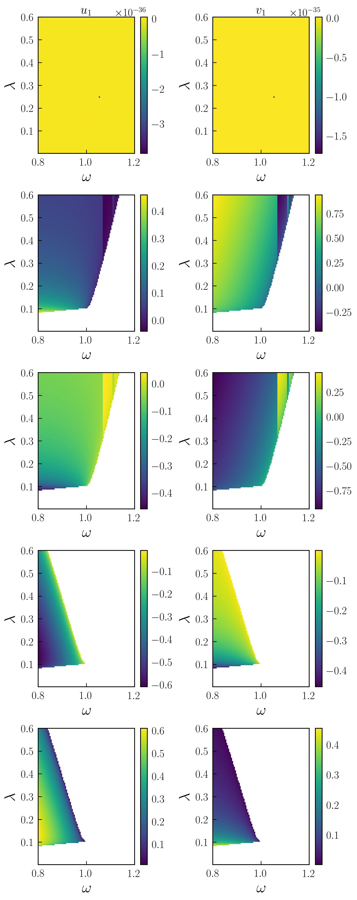
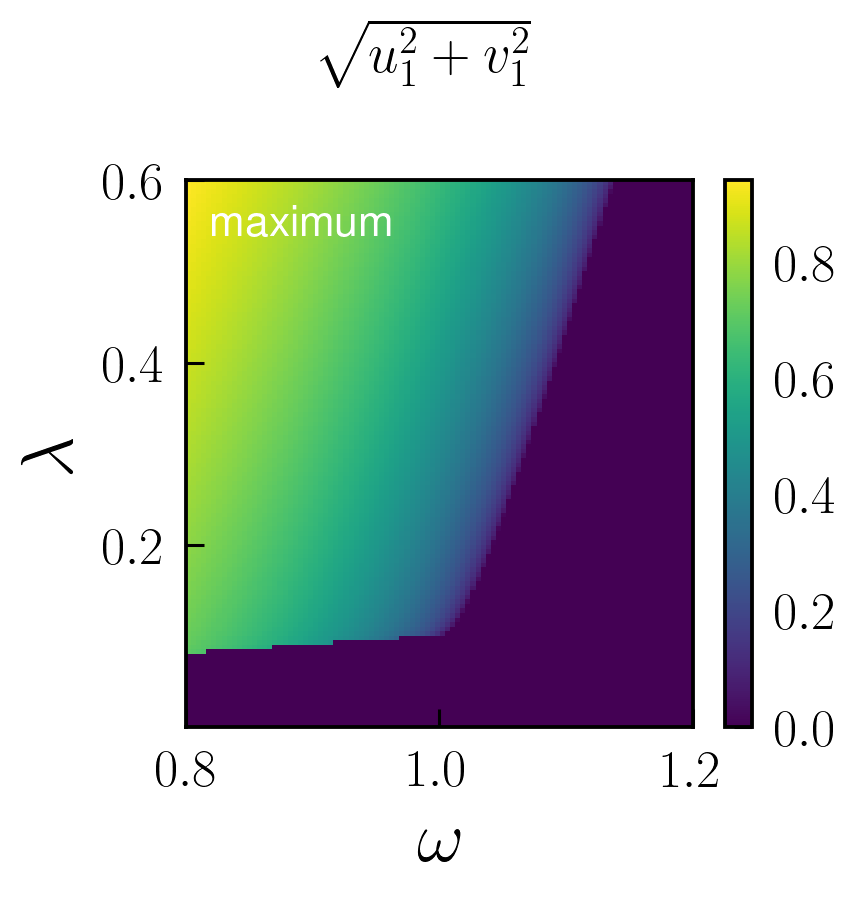

# Phase diagrams and solutions in 2D: parametron

The parametrically driven oscillator boasts a stability diagram called "Arnold's tongues" delineating zones where the oscillator is stable from those where it is exponentially unstable (if the nonlinearity was absence).  We can retrieve this diagram by calculating the steady states as a function of external detuning $\delta=\omega_L-\omega_0$ and the parametric drive strength $\lambda$.  We adress this problem by first obtaining the harmonic equations, i.e. averaging the parametrically driven Duffing oscillator equations around a single frequency $\omega$ (see [Parametrically driven Duffing resonator](https://nonlinearoscillations.github.io/HarmonicBalance.jl/stable/examples/single_parametron/) example).

```julia
using HarmonicBalance,Latexify,PyPlot

@variables ω₁, ω, γ,λ, t, T, α₁, x(t)

# the differential equation of motion
natural_equation = d(d(x, t),t) + ω₁^2*(1-λ*cos(2*ω*t)) * x + γ*d(x,t)  + α₁*x^3

dEOM = DifferentialEquation(natural_equation, x)

HarmonicBalance.add_harmonic!(dEOM, x, ω) # x will rotate at ω

averagedEOM = get_harmonic_equations(dEOM, slow_time=T, fast_time=t)
```

To perform a 2D sweep over driving frequency $\omega$ and parametric drive strength $\lambda$, we simply execute the block
```julia
fixed_parameters = ([(ω₁, 1.),(γ, 0.05),(α₁, -0.99)])

swept_parameters = (ω => LinRange(0.8,1.2,100), λ => LinRange(0.001,0.6,120))

#best results for random_warmup=false, so beginning from a total degree homotopy and pass parameters one by one to the solver
sol_2D = HarmonicBalance.get_steady_states(averagedEOM, swept_parameters, fixed_parameters; random_warmup=false, threading=false,sorting="nearest")
```

Now, we count the number of solutions for each point and represent the corresponding phase diagram in parameter space. For it, we employ `plot_2D_phase_diagram` phase diagram function with `stable=false`

```julia
HarmonicBalance.plot_2D_phase_diagram(sol_2D, stable=false,observable="nsols",filename="plot_2D_phase_diagram")
```
and generates the diagram


 Here we also we gave a value to the `filename` argument, to output plot_data directly as as `.jld2`file. The number of stable solutions can be represented by setting `stable=true` above. We observe boundaries (bifurcations) where the number of solutions changes. 

In addition to phase diagrams, we can directly retrieve plots for the solutions by simply calling 

```julia
    save_dict = HarmonicBalance.plot_2D_solutions(sol_2D)
```
which returns an array of panels with a solution in a given panel in columns corresponding to each harmonic variable $u,v$



Note that solutions are ordered in parameter space according to their closest neighbors. Plots can be limited to a given class (e.g stable solutions only) through the argument `plot_only`, for instance  
```julia
    save_dict = HarmonicBalance.plot_2D_solutions(sol_2D,plot_only=["stable"])
```

Solution maps can also implemented and can be passed through the argument `z`. For instance, the radius $X=\sqrt{u^1+v^2}$ can be represented by passing `z="sqrt(u1^2+v1^2)` (note the automatic naming of the harmonic variables assigns a number even if the problem is single-dimensional). These, individual, solution maps can be combined with multi-solution maps, such as $X$ among different solutions, by adding functions to `plot_only`. For instance

```julia
    save_dict = HarmonicBalance.plot_2D_solutions(sol_2D,plot_only=["stable",Base.maximum],z="sqrt(u1^2+v1^2)")
```
produces a plot depicting  $X$ for all stable solutions:

