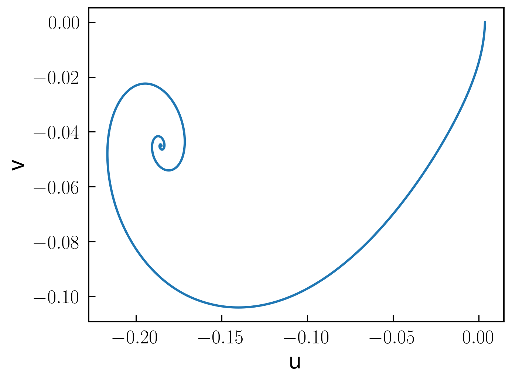

# Time-dependent simulations: parametron

The parametrically driven oscillator can be solved in time domain using the interface with `DifferentialEquations.jl`. 
Here we skip detailed steps in the derivation of the harmonic, slow-flow differential equations, which can be found in 
[Parametrically driven Duffing resonator](https://nonlinearoscillations.github.io/HarmonicBalance.jl/stable/examples/single_parametron/). In short:


```julia
using HarmonicBalance.jl
@variables Ω,γ,λ,F, x,θ,η,α, ω, ψ, x(t), t

natural_equation =  d(d(x,t),t) + γ*d(x,t) + Ω^2*(1-λ*cos(2*ω*t+ψ))*x + α * x^3 + η *d(x,t) * x^2
forces =  F*cos(ω*t+θ)
dEOM = HarmonicBalance.DifferentialEquation(natural_equation + forces, x)

HarmonicBalance.add_harmonic!(dEOM, x, ω);

@time averagedEOM = HarmonicBalance.get_harmonic_equations(dEOM)
```

We choose to visualize the dynamics of the harmonic variables $u,v$ in phase space. For it, we setup the initial conditions $x(t=0)=x_0$ for the simulation

```julia
x0 = [0.0037178842249515134; 0.]
times = (0.,1000.)
dt = 1. # time-resolution of the result (NOT the integration timestep)
fixed_parameters = ParameterList(Ω => 1.0,γ => 1E-2, λ => 5E-2, F => 1E-3,  α => 1., η=>0.3, θ => 0, ψ => 0, ω=>1.)
```

Finally, we solve the harmonic equations and represent the solutions  by

```julia
time_dep = HarmonicBalance.TimeEvolution.ODEProblem(averagedEOM, fixed_parameters, sweep=HarmonicBalance.TimeEvolution.ParameterSweep(), x0 = x0, timespan = times);
time_soln = HarmonicBalance.TimeEvolution.solve(time_dep, saveat=dt);
HarmonicBalance.plot(getindex.(time_soln.u, 1), getindex.(time_soln.u,2))
HarmonicBalance.xlabel("u",fontsize=20)
HarmonicBalance.ylabel("v",fontsize=20)
```

The result is depicted below. At large times, the dynamics is equivalent to a particle spiralling down towards a steadystate, which is not set at $(u,v)=(0,0)$, but at a finite amplitude.


