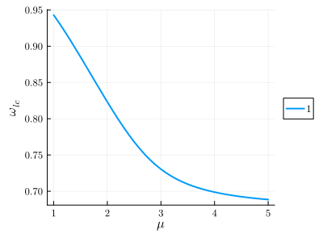

# Limit cycles

In contrast to the previous examples, limit cycle problems feature harmonic(s) whose numerical value is not imposed externally. We shall construct our `HarmonicEquation` as usual, but identify this harmonic as an extra variable, rather than a fixed parameter.

## Non-driven system - the van der Pol oscillator

Here we solve the equation of motion of the [van der Pol oscillator](https://en.wikipedia.org/wiki/Van_der_Pol_oscillator). This is a single-variable second-order ODE with continuous time-translation symmetry (i.e., no 'clock' imposing a frequency and/or phase), which displays periodic solutions known as _relaxation oscillations_. For more detail, refer also to [arXiv:2308.06092](https://arxiv.org/abs/2308.06092).
```julia
using HarmonicBalance
@variables ω_lc, t, ω0, x(t), μ
diff_eq = DifferentialEquation(d(d(x,t),t) - μ*(1-x^2) * d(x,t) + x, x)
```
Choosing to expand the motion of ``x(t)`` using ``ω_{lc}``, ``3ω_{lc}`` and ``5ω_{lc}``, we define
```julia
[add_harmonic!(diff_eq, x, i*ω_lc) for i in 1:2:5]
```
and obtain 6 harmonic equations,
```julia
harmonic_eq = get_harmonic_equations(diff_eq)
```
```julia
A set of 6 harmonic equations
Variables: u1(T), v1(T), u2(T), v2(T), u3(T), v3(T)
Parameters: ω_lc, μ
```
So far, ``ω_{lc}`` appears as any other harmonic. However, it is not fixed by any external drive or 'clock', instead, it emerges out of a Hopf instability in the system. We can verify that fixing `ω_lc` and calling `get_steady_states`.
```julia
get_steady_states(harmonic_eq, μ => 1:0.1:5, ω_lc => 1.2)
```
gives a single solution with zero amplitude.

Taking instead ``ω_{lc}`` as a variable to be solved for [results in a phase freedom](@ref limit_cycles_bg), implying an infinite number of solutions. To perform the [gauge-fixing procedure](@ref gauge_fixing), we call `get_limit_cycles`, marking the limit cycle harmonic as a keyword argument,
```julia
import HarmonicBalance.LimitCycles: get_limit_cycles
result = get_limit_cycles(harmonic_eq, μ => 1:0.1:5, (), cycle_harmonic = ω_lc)
```
```julia
A steady state result for 41 parameter points

Solution branches:   100
   of which real:    4
   of which stable:  4 
```
The results show a fourfold [degeneracy of solutions](@ref degeneracies). The automatically created solution class `unique_cycle` filters the degeneracy out,
```julia
plot(result, ω_lc)
```


```julia
plot(result, ω_lc, class="unique_cycle")
```


## Driven system - coupled Duffings

Under construction, see Chapter 6.2.2 of [Jan's thesis](https://www.research-collection.ethz.ch/handle/20.500.11850/589190)

